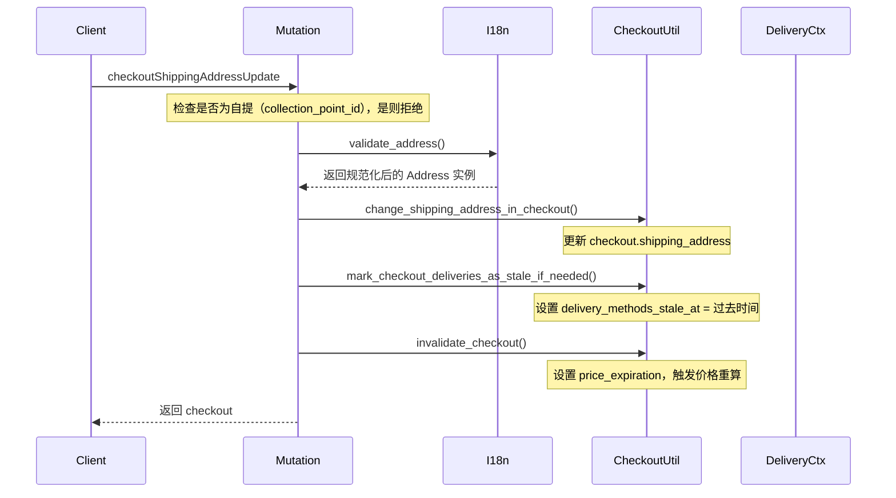
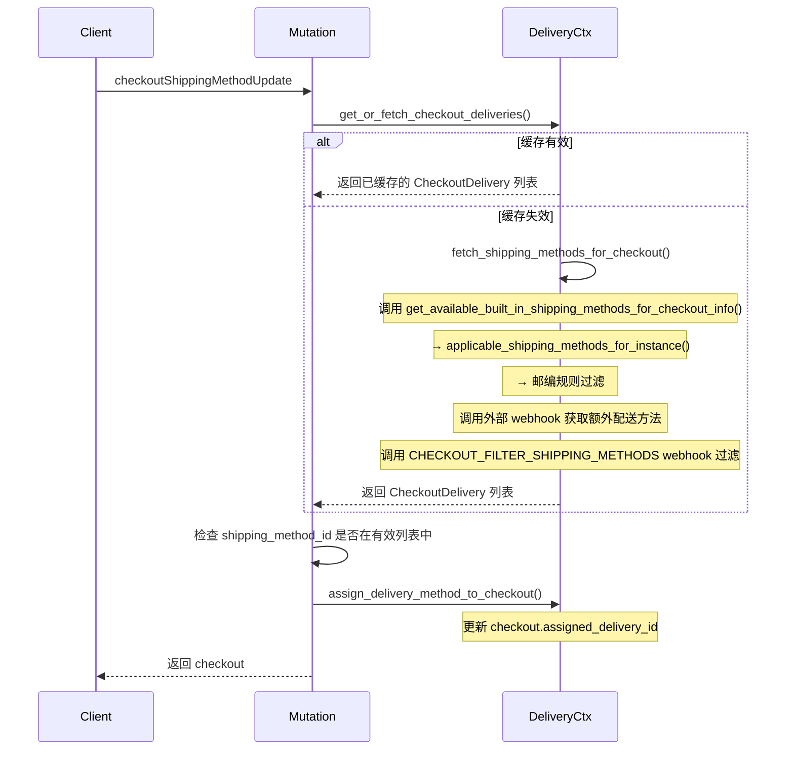
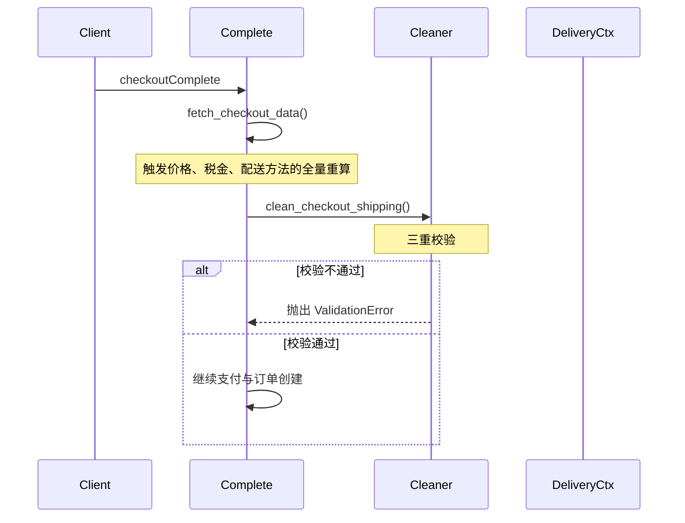
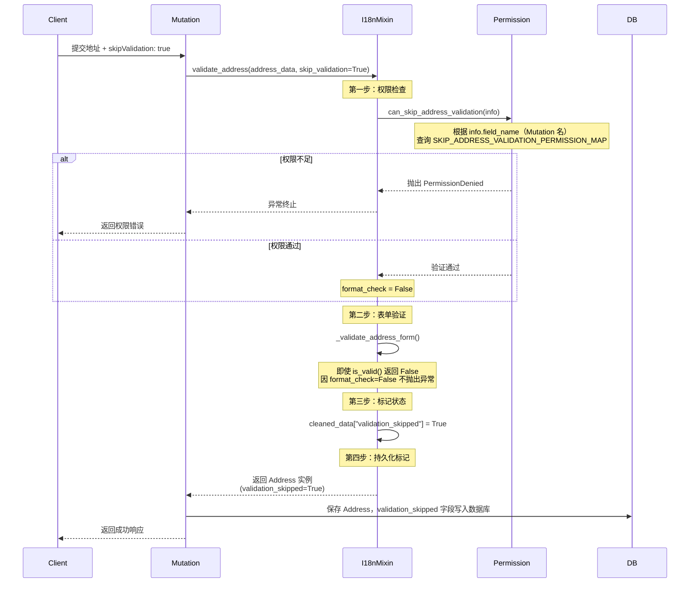

# 下单地址校验与配送区匹配协作流程

## 一、整体架构概览

整个流程分为四个核心层次，按调用顺序依次衔接：

```
GraphQL Mutation 入口层
        ↓
地址规整与校验层（I18n + Form）
        ↓
配送区匹配核心层（ShippingMethodQueryset + PostalCode）
        ↓
Checkout 生命周期管理层（地址变更 → 配送方法选择 → 下单最终校验）
```

---

## 二、数据模型层

### 2.1 核心模型关系

**文件**：`saleor/shipping/models.py`

| 模型 | 关键字段 | 说明 |
|------|----------|------|
| `ShippingZone` | `countries` (多国家), `channels`, `default` | 配送区域，包含多个国家 |
| `ShippingMethod` | `shipping_zone_id`, `type` (PRICE_BASED/WEIGHT_BASED), `min/max_order_weight`, `excluded_products` | 配送方法，归属于某个配送区 |
| `ShippingMethodPostalCodeRule` | `shipping_method_id`, `start`, `end`, `inclusion_type` (INCLUDE/EXCLUDE) | 邮编规则，精确到某配送方法 |
| `ShippingMethodChannelListing` | `shipping_method_id`, `channel_id`, `min/max_order_price`, `price` | 渠道维度的价格与订单金额限制 |

**关键关联**：
- `ShippingZone.countries` 使用 `CountryField(multiple=True)`，支持多国家
- `ShippingMethod` 通过外键关联到 `ShippingZone`
- 邮编规则是 `ShippingMethod` 的子对象，通过 `postal_code_rules` 反向关联

---

## 三、地址规整与校验层

### 3.1 调用链总览

```
GraphQL Mutation
    ↓
I18nMixin.validate_address() [graphql/account/i18n.py:155]
    ↓
I18nMixin._validate_address_form() [graphql/account/i18n.py:73]
    ↓
get_address_form() [account/forms.py:6]
    ↓
get_address_form_class() → CountryAwareAddressForm [account/i18n.py:251]
    ↓
CountryAwareAddressForm.validate_address() [account/i18n.py:196]
    ↓
i18naddress.normalize_address() [第三方库]
```

### 3.2 关键节点详解

#### 3.2.1 `I18nMixin.validate_address()` [graphql/account/i18n.py:155]

**参数控制**：
- `format_check`: 是否校验字段格式（默认 `True`）
- `required_check`: 是否校验必填字段（默认 `True`）
- `enable_normalization`: 是否启用地址规范化（默认 `True`）
- `preserve_all_address_fields`: 是否保留非标准字段（从 site settings 读取）

**核心逻辑**：
```python
# 1. 检查 country 必填
if address_data.get("country") is None:
    raise ValidationError(...)

# 2. 处理 skip_validation 权限
if address_data.get("skip_validation"):
    cls.can_skip_address_validation(info)
    format_check = False

# 3. 调用表单验证
address_form = cls._validate_address_form(...)
address_data = address_form.cleaned_data

# 4. 构造 Address 实例
if not instance:
    instance = Address()
cls.construct_instance(instance, address_data)
```

#### 3.2.2 `CountryAwareAddressForm.validate_address()` [account/i18n.py:196]

**地址规整四步走**：

1. **字段映射**：将 Saleor 的字段映射为 i18naddress 库的字段
   ```python
   I18N_MAPPING = [
       ("name", ["first_name", "last_name"]),
       ("street_address", ["street_address_1", "street_address_2"]),
       ("city_area", ["city_area"]),
       ("country_area", ["country_area"]),
       ("postal_code", ["postal_code"]),
       ("city", ["city"]),
       ("country_code", ["country"]),
   ]
   ```

2. **无效值替换**：`substitute_invalid_values()` 将不规范的地区名映射为标准值（如 "加州" → "CA"）

3. **规范化**：`i18naddress.normalize_address(data)` 调用第三方库进行地址标准化

4. **非标准字段恢复**：`_restore_non_allowed_fields()` 恢复被规范化过滤掉的、但原始数据中存在的字段

---

## 四、配送区匹配核心层

### 4.1 总调用链

```
get_valid_internal_shipping_methods_for_checkout_info() [checkout/delivery_context.py:176]
    ↓
ShippingMethodQueryset.applicable_shipping_methods_for_instance() [shipping/models.py:170]
    ↓
ShippingMethodQueryset.applicable_shipping_methods() [shipping/models.py:140]
    ↓ 价格/重量过滤
filter_shipping_methods_by_postal_code_rules() [shipping/postal_codes.py:117]
    ↓
is_shipping_method_applicable_for_postal_code() [shipping/postal_codes.py:96]
    ↓
check_postal_code_in_range() [shipping/postal_codes.py:75]
```

### 4.2 `applicable_shipping_methods_for_instance()` [shipping/models.py:170]

**参数**：
- `instance`: Checkout 或 Order 对象
- `channel_id`: 渠道 ID
- `price`: 订单小计金额（Money 对象）
- `shipping_address`: 配送地址
- `country_code`: 国家代码（可从地址自动提取）
- `lines`: 订单行，用于提取产品 ID 和计算重量

**核心逻辑**：

```python
def applicable_shipping_methods_for_instance(...):
    # 1. 无地址直接返回 None
    if not shipping_address:
        return None

    # 2. 提取国家代码
    if not country_code:
        country_code = shipping_address.country.code

    # 3. 提取产品 ID（用于排除规则）
    instance_product_ids = {
        line.variant.product_id for line in lines if line.variant
    }

    # 4. 计算重量
    if isinstance(instance, Checkout):
        weight = calculate_checkout_weight(lines)
    else:
        weight = instance.weight

    # 5. 调用基础匹配方法
    applicable_methods = self.applicable_shipping_methods(
        price=price,
        channel_id=channel_id,
        weight=weight,
        country_code=country_code,
        product_ids=instance_product_ids,
    ).prefetch_related("postal_code_rules")

    # 6. 邮编规则过滤
    return filter_shipping_methods_by_postal_code_rules(
        applicable_methods, shipping_address
    )
```

### 4.3 `applicable_shipping_methods()` [shipping/models.py:140]

**四层过滤**：

| 过滤层级 | 代码位置 | 说明 |
|----------|----------|------|
| 国家 + 渠道 | L148-153 | `shipping_zone__countries__contains=country_code` AND `shipping_zone__channels__id=channel_id` |
| 产品排除 | L160-161 | 排除 `excluded_products` 中包含的产品 |
| 价格区间 | L162-164 | 调用 `_applicable_price_based_methods()` |
| 重量区间 | L165 | 调用 `_applicable_weight_based_methods()` |

### 4.4 邮编规则匹配 [shipping/postal_codes.py]

#### 4.4.1 `check_postal_code_in_range()` [L75]

**国家特殊处理**：
```python
country_func_map = {
    "GB": check_uk_postal_code,      # 英国：BH20 2BC
    "IM": check_uk_postal_code,      # 马恩岛
    "GG": check_uk_postal_code,      # 根西岛
    "JE": check_uk_postal_code,      # 泽西岛
    "IE": check_irish_postal_code,   # 爱尔兰：A65 2F0A
}
```

**UK 邮编解析** [L45-54]：
- 正则：`r"^([A-Z]{1,2})([0-9]+)([A-Z]?) ?([0-9][A-Z]{2})$"`
- 分组：(字母)(数字)(可选字母) (数字+字母)
- 第二组转 int 后进行区间比较

#### 4.4.2 `is_shipping_method_applicable_for_postal_code()` [L96]

**规则判定逻辑**：
```python
results = {rule: check_postal_code_in_range(...)}

if not results:
    return True  # 无规则 → 适用

# 全 INCLUDE 规则：任一命中即适用
if all(rule.inclusion_type == INCLUDE):
    return any(results.values())

# 全 EXCLUDE 规则：任一命中即不适用
if all(rule.inclusion_type == EXCLUDE):
    return not any(results.values())

# 混合规则 → 不支持，返回 False
return False
```

---

## 五、Checkout 生命周期管理层

### 5.1 场景一：更新配送地址

**Mutation**：`CheckoutShippingAddressUpdate` [graphql/checkout/mutations/checkout_shipping_address_update.py]



**关键函数**：
- `change_shipping_address_in_checkout()` [checkout/utils.py:402]：保存地址并返回需要更新的字段
- `mark_checkout_deliveries_as_stale_if_needed()`：地址变更后，配送方法缓存失效

### 5.2 场景二：选择配送方法

**Mutation**：`CheckoutShippingMethodUpdate` [graphql/checkout/mutations/checkout_shipping_method_update.py]



**关键函数**：
- `get_or_fetch_checkout_deliveries()` [checkout/delivery_context.py:732]：带 TTL 缓存，`CHECKOUT_DELIVERY_OPTIONS_TTL` 控制有效期
- `fetch_shipping_methods_for_checkout()` [checkout/delivery_context.py:587]：完整获取流程

### 5.3 场景三：下单最终校验

**入口**：`complete_checkout_pre_payment_part()` → `_prepare_checkout_with_payment()` [checkout/complete_checkout.py:1088]



**`clean_checkout_shipping()` 三重校验** [checkout/checkout_cleaner.py:25]：

| 校验项 | 代码 | 错误码 |
|--------|------|--------|
| 配送方法是否设置 | L37-44 | `SHIPPING_METHOD_NOT_SET` |
| 配送地址是否设置 | L46-54 | `SHIPPING_ADDRESS_NOT_SET` |
| 配送方法是否对地址有效 | L55-64 | `INVALID_SHIPPING_METHOD` |

**第三重校验核心**：
```python
if not delivery_method_info.is_method_in_valid_methods(checkout_info):
    if checkout_info.checkout.collection_point_id:
        clear_cc_delivery_method(checkout_info)
    raise ValidationError(
        "Delivery method is not valid for your shipping address",
        code=error_code.INVALID_SHIPPING_METHOD.value,
    )
```

`is_method_in_valid_methods()` 对于 `ShippingMethodInfo` 实现 [checkout/delivery_context.py:97-98]：
```python
def is_method_in_valid_methods(self, checkout_info) -> bool:
    return self.delivery_method.active
```

即：配送方法数据对象的 `active` 字段决定是否有效。该字段在 `initialize_shipping_method_active_status()` [shipping/utils.py:130] 中根据排除规则设置。

---

## 六、关键衔接点总结

### 6.1 地址 → 配送区 的数据流转

| 步骤 | 数据来源 | 处理 | 输出 |
|------|----------|------|------|
| 1 | 用户输入地址 | I18n 规范化 | `Address` 实例 |
| 2 | `Address.country.code` | `ShippingZone.countries__contains` 查询 | 匹配国家的 `ShippingZone` 列表 |
| 3 | `ShippingZone.id` | 关联查询 `ShippingMethod` | 候选配送方法列表 |
| 4 | `Address.postal_code` | 邮编规则逐行校验 | 最终可用配送方法 |

### 6.2 缓存失效时机

| 操作 | 缓存处理 | 位置 |
|------|----------|------|
| 更新配送地址 | `mark_checkout_deliveries_as_stale_if_needed()` 设置 `delivery_methods_stale_at` 为过去时间 | `checkout_shipping_address_update.py:205` |
| 更新商品 | `invalidate_checkout()` 触发价格失效，间接导致配送方法重算 | `checkout/utils.py:76` |
| 优惠券变更 | 同上 | - |
| TTL 过期 | `delivery_methods_stale_at <= now` 时重新获取 | `checkout/delivery_context.py:743` |

### 6.3 错误码汇总

| 错误码 | 触发时机 | 所在模块 |
|--------|----------|----------|
| `SHIPPING_CHANGE_FORBIDDEN` | 自提订单尝试修改配送地址 | `checkout_shipping_address_update.py:163` |
| `SHIPPING_METHOD_NOT_APPLICABLE` | 选择的配送方法不在有效列表中 | `checkout_shipping_method_update.py:135` |
| `SHIPPING_NOT_REQUIRED` | 不需要配送的商品尝试设置配送方法 | `checkout_shipping_method_update.py:182` |
| `SHIPPING_METHOD_NOT_SET` | 下单时未选择配送方法 | `checkout_cleaner.py:41` |
| `SHIPPING_ADDRESS_NOT_SET` | 下单时未设置配送地址 | `checkout_cleaner.py:49` |
| `INVALID_SHIPPING_METHOD` | 配送方法对当前地址无效 | `checkout_cleaner.py:61` |

---

## 七、核心文件清单

| 文件 | 职责 |
|------|------|
| `saleor/account/i18n.py` | 地址规范化表单与 I18nMixin |
| `saleor/account/forms.py` | 地址表单工厂 |
| `saleor/shipping/models.py` | 配送区/方法数据模型 + QuerySet 匹配逻辑 |
| `saleor/shipping/postal_codes.py` | 邮编区间匹配算法 |
| `saleor/shipping/utils.py` | 配送方法数据转换与状态初始化 |
| `saleor/checkout/delivery_context.py` | 配送上下文、缓存管理、方法获取 |
| `saleor/checkout/checkout_cleaner.py` | 下单前最终校验 |
| `saleor/checkout/complete_checkout.py` | 完整下单流程编排 |
| `saleor/graphql/checkout/mutations/checkout_shipping_address_update.py` | 更新配送地址 Mutation |
| `saleor/graphql/checkout/mutations/checkout_shipping_method_update.py` | 选择配送方法 Mutation |

---

## 八、附录 A：I18nMixin 归属与继承体系

### 8.1 Mixin 归属澄清

**常见误解**：I18nMixin 归属于 `account` 模块

**实际归属**：`saleor/graphql/account/i18n.py:58`

- **位置**：`graphql/account/` 命名空间下，而非 `account/`
- **性质**：纯 GraphQL 层工具类，与业务模型层解耦
- **设计意图**：为 Mutation 提供地址校验的横向能力

### 8.2 继承关系图

```
graphene.Mutation
    ↓
BaseMutation [graphql/core/mutations.py:142]
    ↓  (多继承)
CheckoutShippingAddressUpdate(AddressMetadataMixin, BaseMutation, I18nMixin)
                                  ↑
                        地址校验能力注入点
```

**继承顺序说明**：
1. `AddressMetadataMixin`：提供元数据处理能力
2. `BaseMutation`：提供基础 Mutation 框架（错误处理、权限检查等）
3. `I18nMixin`：注入地址校验方法

### 8.3 使用 I18nMixin 的 Mutation 清单

| Mutation | 用途 |
|----------|------|
| `CheckoutShippingAddressUpdate` | 更新结账配送地址 |
| `CheckoutBillingAddressUpdate` | 更新结账账单地址 |
| `CheckoutCreate` | 创建结账 |
| `CheckoutComplete` | 完成结账（下单） |
| `CheckoutPaymentCreate` | 创建支付 |
| `AddressCreate` | 创建用户地址 |
| `BaseAddressUpdate` | 更新地址基类 |
| `BaseCustomerCreate` | 创建客户基类 |
| `CustomerBulkUpdate` | 批量更新客户 |
| `OrderUpdate` | 更新订单 |
| `DraftOrderCreate` | 创建草稿订单 |
| `DraftOrderUpdate` | 更新草稿订单 |
| `OrderBulkCreate` | 批量创建订单 |
| `WarehouseShippingZoneAssign` | 仓库配送区分配 |
| `WarehouseShippingZoneUnassign` | 仓库配送区解除 |
| `ShopAddressUpdate` | 更新店铺地址 |

### 8.4 Skip Validation 机制完整流程

#### 8.4.1 权限映射表 [graphql/account/i18n.py:20-55]

每个 Mutation 有独立的跳过校验权限配置：

```python
SKIP_ADDRESS_VALIDATION_PERMISSION_MAP = {
    "checkoutCreate": [
        CheckoutPermissions.HANDLE_CHECKOUTS,
        AuthorizationFilters.AUTHENTICATED_APP,
    ],
    "checkoutShippingAddressUpdate": [
        CheckoutPermissions.HANDLE_CHECKOUTS,
        AuthorizationFilters.AUTHENTICATED_APP,
    ],
    # ... 其他 Mutation
}
```

#### 8.4.2 执行时序



#### 8.4.3 validation_skipped 标记的下游影响

| 模块 | 检测点 | 行为 |
|------|--------|------|
| `Address.as_data()` | `account/models.py:118` | 若 `validation_skipped=True`，跳过电话号码 E.164 格式化 |
| `Avatax Plugin` | `plugins/avatax/plugin.py:364` | 税金计算前输出警告日志 |
| `Order Calculations` | `order/calculations.py:442` | 税金计算前输出警告日志 |
| `CheckoutComplete` | `graphql/checkout/mutations/checkout_complete.py:205,228` | 若未跳过校验，则调用 I18n 重新校验地址 |

**警告日志示例**：
```python
# checkout/utils.py:947-956
def log_address_if_validation_skipped_for_checkout(checkout_info, logger):
    address = get_address_for_checkout_taxes(checkout_info)
    if address and address.validation_skipped:
        logger.warning(
            "Fetching tax data for checkout with address validation skipped. "
            "Address ID: %s",
            address.id,
        )
```

---

## 九、附录 B：校验失败原因传递路径

### 9.1 错误消息完整链路

```
Django Form Errors (dict)
        ↓ [attach_params_to_address_form_errors]
    按 format_check/required_check 过滤
        ↓
ValidationError(error_dict)
        ↓ [BaseMutation.mutate 捕获]
handle_errors(e) → validation_error_to_error_type()
        ↓
ErrorType 实例列表 (含 field/message/code)
        ↓
GraphQL Response { errors: [...] }
```

### 9.2 关键节点详解

#### 9.2.1 Django Form → ValidationError 转换 [graphql/account/i18n.py:73-122]

```python
def _validate_address_form(cls, address_data, ...):
    # 1. 执行表单验证
    if not address_form.is_valid():
        validation_skipped = True
        
        # 2. 错误处理入口
        errors = cls.attach_params_to_address_form_errors(
            address_form, params, format_check, required_check
        )
        
        # 3. 有错误才抛出
        if errors:
            raise ValidationError(errors)
```

#### 9.2.2 错误过滤逻辑 [graphql/account/i18n.py:125-152]

`attach_params_to_address_form_errors()` 实现了条件性错误抛出：

```python
def attach_params_to_address_form_errors(...):
    address_errors_dict = address_form.errors.as_data()
    
    for field, errors in address_errors_dict.items():
        for error in errors:
            
            # 情形 A：格式错误（code != "required"）
            if error.code != "required":
                if values_check:  # 即 format_check
                    errors_dict[field] = errors  # 加入错误
                else:
                    # 跳过校验：保留原始值到 cleaned_data
                    address_form.cleaned_data[field] = address_form.data[field]
            
            # 情形 B：必填错误（code == "required"）
            if error.code == "required":
                field_value = address_form.data.get(field)
                if required_check:
                    errors_dict[field] = errors  # 加入错误
                elif field_value is not None:
                    # 有值则接受：即使不符合表单要求
                    address_form.cleaned_data[field] = field_value
    
    return errors_dict
```

**过滤矩阵**：

| 错误类型 | format_check | required_check | 结果 |
|----------|-------------|----------------|------|
| 格式错误 | True | 任意 | 抛出错误 |
| 格式错误 | False | 任意 | 忽略，保留原始值 |
| 必填错误 | 任意 | True | 抛出错误 |
| 必填错误 | 任意 | False | 有值则接受，无值则忽略 |

#### 9.2.3 ValidationError → GraphQL Error 转换 [graphql/core/mutations.py:87-118]

`validation_error_to_error_type()` 负责将 Django 异常转换为 GraphQL 错误对象：

```python
def validation_error_to_error_type(validation_error: ValidationError, error_type_class):
    err_list = []
    error_class_fields = set(error_type_class._meta.fields.keys())
    
    if hasattr(validation_error, "error_dict"):
        # 字段级错误
        for field_label, field_errors in validation_error.error_dict.items():
            # 转换字段名：snake_case → camelCase
            field = snake_to_camel_case(field_label) if field_label != NON_FIELD_ERRORS else None
            
            for err in field_errors:
                error = error_type_class(
                    field=field,
                    message=err.messages[0],  # 取第一条消息
                    code=get_error_code_from_error(err),
                )
                # 附加额外参数（如 address_type）
                attach_error_params(error, err.params, error_class_fields)
                err_list.append(error)
    else:
        # 非字段错误
        for err in validation_error.error_list:
            error = error_type_class(
                message=err.messages[0],
                code=get_error_code_from_error(err),
            )
            attach_error_params(error, err.params, error_class_fields)
            err_list.append(error)
    
    return err_list
```

#### 9.2.4 BaseMutation 异常捕获机制 [graphql/core/mutations.py:518-547]

```python
def mutate(cls, root, info: ResolveInfo, **data):
    disallow_replica_in_context(info.context)
    setup_context_user(info.context)

    if not cls.check_permissions(info.context, data=data):
        raise PermissionDenied(permissions=cls._meta.permissions)

    try:
        # 执行具体 Mutation 逻辑
        response = cls.perform_mutation(root, info, **data)
        if response.errors is None:
            response.errors = []
        return response
    except ValidationError as e:
        # 统一转换为 GraphQL 错误格式
        return cls.handle_errors(e)

@classmethod
def handle_errors(cls, error: ValidationError, **extra):
    error_list = validation_error_to_error_type(error, cls._meta.error_type_class)
    return cls.handle_typed_errors(error_list, **extra)

@classmethod
def handle_typed_errors(cls, errors: list, **extra):
    if cls._meta.error_type_field is not None:
        extra.update({cls._meta.error_type_field: errors})
    # 返回包含 errors 字段的响应，而非抛出异常
    return cls(errors=errors, **extra)
```

### 9.3 典型错误响应示例

**请求**（邮编格式错误）：
```graphql
mutation {
  checkoutShippingAddressUpdate(
    id: "Q2hlY2tvdXQ6MQ=="
    shippingAddress: {
      country: US
      postalCode: "INVALID"
      streetAddress1: "123 Main St"
      city: "New York"
    }
  ) {
    checkout {
      id
    }
    errors {
      field
      message
      code
    }
  }
}
```

**响应**（校验失败）：
```json
{
  "data": {
    "checkoutShippingAddressUpdate": {
      "checkout": null,
      "errors": [
        {
          "field": "postalCode",
          "message": "Invalid postal code format.",
          "code": "INVALID"
        }
      ]
    }
  }
}
```

**响应**（skipValidation + 权限通过）：
```json
{
  "data": {
    "checkoutShippingAddressUpdate": {
      "checkout": {
        "id": "Q2hlY2tvdXQ6MQ==",
        "shippingAddress": {
          "postalCode": "INVALID",
          "validationSkipped": true
        }
      },
      "errors": []
    }
  }
}
```
